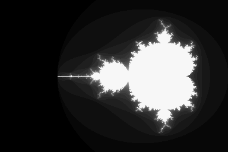

An evening's hack: a tweetable, 139 character `dc` program to render a Mandelbrot set.

```
$ dc -e '?[P5]Pfswshsm9k[q]sQ0sq[0[dlw/4*3-salqlh/3*1.5-sb0ddsxsy[lxd*lyd*+4!>Qlxdd*lyd*-la+sx2ly**lb+sy1+dlm>I]dsIx1-P1+dlw>X]dsXxclq1+dsqlh>Y]dsYx' > mandelbrot.pgm <<<'32 256 384'
```

Here, 32 is the max iterations, 256 is the pixel height, and 384 is the pixel width. The program takes those three parameters from stdin and prints a PGM format grayscale bitmap to stdout.



It might take a while if you use big numbers. 128 1024 1536 took about 15 minutes on my i5 3750K.

Maximum iteration count is 255.
